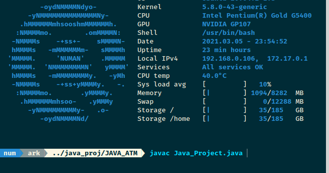
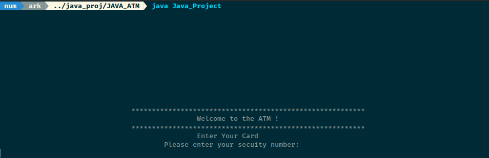
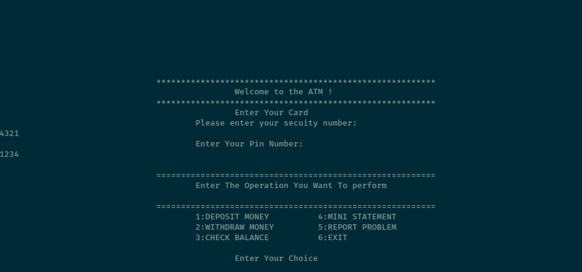
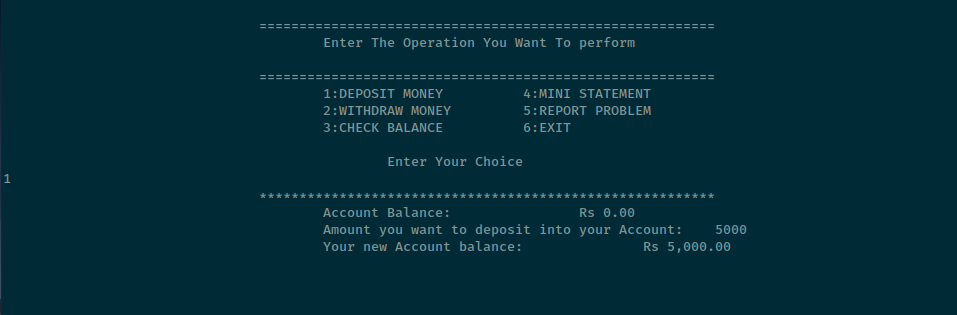
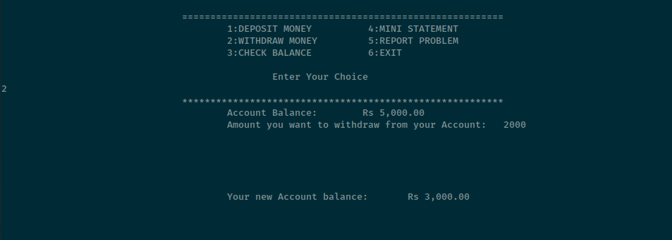
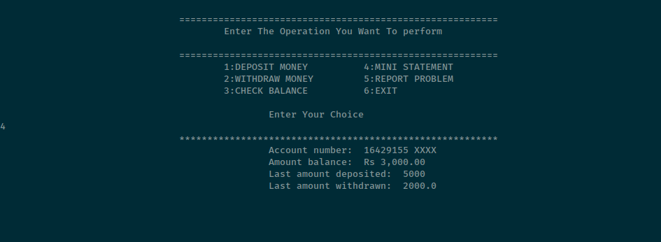
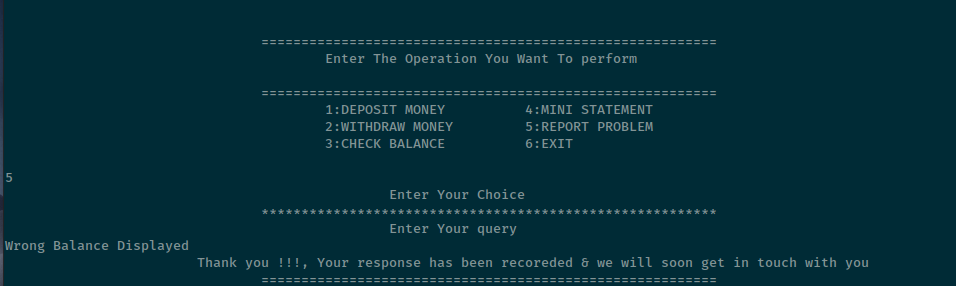

# cli- ATM Machine

This project was made as a mini-project for my JAVA class

It is a simple ATM-Machine simulator in Command Line showcasing basic CRUD functionality using OOP concepts

### Steps to Use:

1. Compile the program with 'javac' as keyword followed my class name. After compiling you will see a number of classes compiled with file extension '.class'

    

For this ^ awesome shell greeter refer [here](https://github.com/numanSlm/synth-shell-greeter)

2. Run the program with 'java' keyword followed by the main class name, here "Java_Project"

    

3. Start using 

    (The default account credentials can be found on line 162 in main src, since you need a live account to access ATM)

    

    ### Enter credentials
    
    ### Deposit
    
    ### Withdraw
    
    ### Mini Statement
    
    ### Feedback
    
